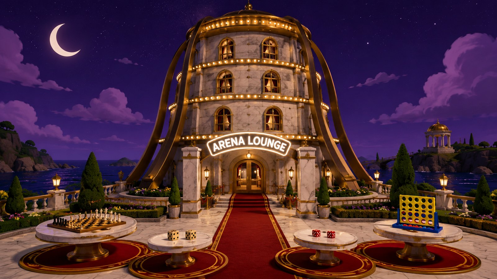
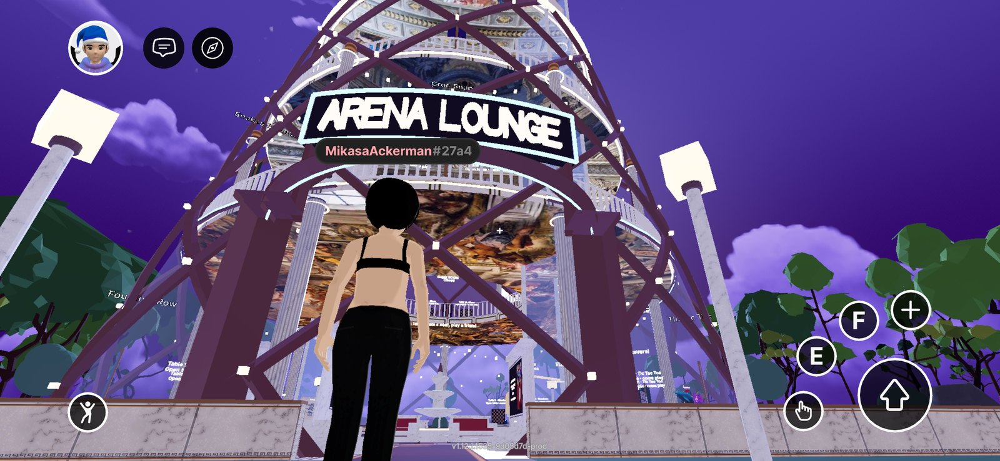
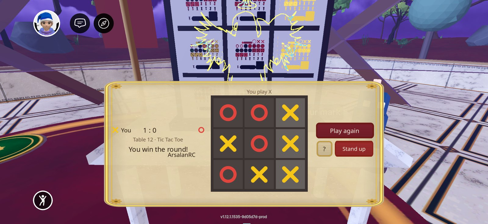
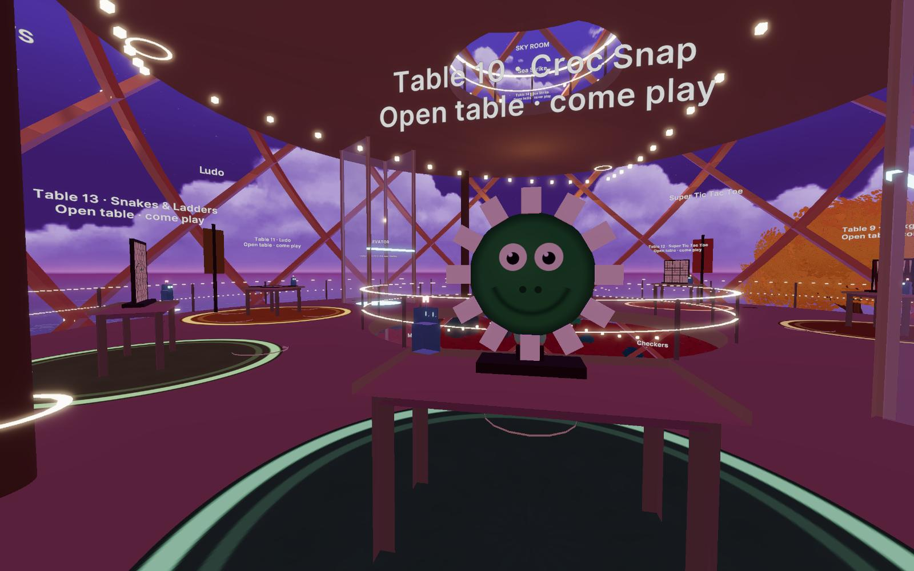

# Arena Lounge

**Live World:** [arenalounge.dcl.eth](https://decentraland.org/jump/?realm=arenalounge.dcl.eth) (open on a phone with the Decentraland app installed, or on desktop).

A game lounge for Decentraland, built for phones first. Walk in under the
marble palace tower, pick a corner, take a seat, and play Four in a Row, Dot Lines,
Reversi, Tic Tac Toe, Match Pairs, Checkers, Chess, Croc Snap, Backgammon,
Ludo, Super Tic Tac Toe, Snakes & Ladders, Sea Strike or a Dice Royale duel
against a friend or the house bot. Every table is shared: whoever is in the World sees
the same moves. Elevator pads take you up to the game room and the rooftop
terrace.

Built for the [Decentraland Friendzone Mobile Buildathon 2026](https://dorahacks.io/hackathon/2353/detail).

<table>
  <tr>
    <td width="50%"></td>
    <td width="50%"></td>
  </tr>
  <tr>
    <td width="50%"></td>
    <td width="50%"></td>
  </tr>
</table>

- **World:** `arenalounge.dcl.eth` (live since 17 Aug 2026)
- **Page:** https://arsalanrc.github.io/arena-lounge/ (EN / DE)
- **Stack:** Decentraland SDK7 (TypeScript, React-ECS UI, CRDT sync); no game server. The rooftop leaderboard is the one thing outside the World: a small Supabase project reached over HTTPS, written only through signed reports (see below)
- **License:** MIT

## Why it fits a phone

- **UI is the controller, the 3D table is the show.** On mobile, tapping a 3D
  object means aiming a crosshair; tapping screen UI is direct. Seated players
  get a bottom bar with finger-sized controls: seven drop buttons for Connect
  Four, a board with 56-unit cells for the board games, a ring of teeth for
  Croc Snap, a board of 24 points plus a Roll button for Backgammon. Spectators watch the real board.
- **One tap to play.** Walk near a table and a card offers *Sit as Yellow*,
  *Sit as Red* or *Play the house bot*. Sitting snaps you onto the seat pad,
  facing the board, in first person. *Stand up* is always one tap away.
- **One step to change floors.** Stand on an elevator pad and a panel offers
  Lounge / Game room / Rooftop; a tap teleports you there. No stairs.
- **Nothing heavy to download.** Small generated GLBs written by Python
  scripts (tower, facade, marquee, elevator shafts, furniture), compact
  procedural textures and tiny synthesised sounds; the production script is
  under 1 MB, so it loads in seconds on 4G.
- **Measured, not guessed.** On a real iPhone with graphics forced to maximum
  the stats panel reads **100% performance** at every spot tested: 116k of
  1.2M triangles, ~850 of 6K entities, 49 of 500 textures, 21.7 MB content.
  Twenty-eight tables on four floors.
- **Safe-area aware, no hover states, no tiny targets, no particles.** The
  night look is carried by emissive materials (string lights, neon, glowing
  rims, self-lit rugs and frescoes), so it reads identically on the mobile
  client, which renders no scene lights at all; the sky is fixed at a clean
  22:00 night so the lighting is the same for everyone, always.

## Why it is social

- Tables are shared CRDT state (`syncEntity`): seats, board, series score and
  turn timer are identical for everyone in the World, late joiners included.
- Empty seat? The floating sign says who is waiting for a rival. Full table?
  Stand behind either player and watch.
- Alone? The house bot keeps the table warm until a human shows up
  (minimax for the strategy games, memory for Match Pairs, pure luck for Croc
  Snap). Bots never sit alone: they leave with their human.
- 60-second turn timer, auto-stand when you wander off, and seat heartbeats so
  a dropped connection never blocks a table.

## Leaderboard (rooftop terrace)

Wins against real people, current and best streak, top ten on the rooftop
board and your own totals behind the "?" button. Rounds against the house bot
do not count. The data lives in a small Supabase project (`supabase/`):

- Reads go through two row-level-secured RPCs with the public key.
- Writes go through an Edge Function called with Decentraland's `signedFetch`:
  the function verifies the wallet signature and treats the signer as the
  player, so nobody can post results for another address, or from a script.
- A round is counted only when a second human of that round reports a
  consistent outcome (no two winners, a draw only with a draw), with a pace cap
  per address. Unmatched claims never reach the board.

Setup notes for a fresh project: `docs/LEADERBOARD-SETUP.md`.

## Play it locally

```bash
pnpm install
pnpm start            # desktop Explorer preview
pnpm start:mobile     # prints a QR; scan it with the Decentraland mobile app (same Wi-Fi)
pnpm start:pair       # one server for desktop + phone (they share the comms room)
pnpm test             # engine unit tests
pnpm build            # bundle + strict type-check
pnpm build:prod       # the minified bundle that `deploy` ships
```

Requires Node 20+, pnpm 9+, and the Decentraland desktop client for the
desktop preview. The project uses pnpm with a hoisted `node_modules` because
the SDK resolves `@dcl/ecs` relative to `@dcl/js-runtime`.

## Project layout

| Path | What lives there |
|------|------------------|
| `src/engine/` | Pure TypeScript game engines with unit tests, no SDK imports. Copied from [Game Arena](https://github.com/fgamesforfun-star/game-platform); the chess bot gained a time budget for phones. |
| `src/lounge/config.ts` | Scene layout (48 m scene, fenced lounge, floors, zones, elevator), tunables, palette |
| `src/lounge/state.ts` | Synced components `TableBoard`, `TableSeatA..D` (C and D only on four-seat tables) |
| `src/lounge/games/` | The `TableGame` contract (`types.ts`), the registry and one plugin per game (rules bridge + touch controls) |
| `src/lounge/views/` | One 3D view per game (boards, sliding piece pools) + shared primitive builders |
| `src/lounge/tables.ts` | Seat / turn / bot / janitor logic, elevator rides, all systems. The write discipline for CRDT lives here |
| `src/lounge/table3d.ts` | The generic 3D table: top, seat pads, robot token, sign, sounds; hosts the game view |
| `src/lounge/lounge3d.ts` | Garden ring, fenced lounge, plaza, corners, the tower, elevator pads, game room and rooftop |
| `src/lounge/ui.tsx` | React-ECS UI: hint, toast, table card, elevator panel, seated controller, how-to-play panel |
| `src/lounge/i18n/` | Rule overviews in 19 languages (from Game Arena) + lounge tips |
| `models/` | Sixteen GLBs (tower, facade + marquee, shafts, furniture, props) generated by `tools/gen-models.py`; `models/palace/` marble set from `tools/gen-marble.py` |
| `tools/gen-textures.py` | Regenerates every PNG in `images/` procedurally (no PIL needed); `tools/gen-atlas.py` packs the UI sprites into `images/ui/atlas.png` (one texture instead of 36); `tools/gen-music.py` renders the lounge loop |
| `supabase/` | Leaderboard schema + RPCs (001..003) and the `report` Edge Function |
| `tools/dev/` | Explorer MCP harness for headless testing, deploy helpers, Supabase wrappers |

## Networking model (serverless)

Each table is one entity with three last-write-wins components so writers
never clobber each other:

- `TableBoard` (game id + engine state as JSON + turn, status, score) is
  written by the player to move, by whoever seats the second player (deal),
  or by a seated player applying the turn timeout.
- `TableSeatA..D` are written by the seat holder (claim, heartbeat, leave)
  or by any client when the holder went silent for 30 s. Ludo seats up to
  four: the first seated player picks the player count, bots fill the rest.

The pure engine validates every move; a client only writes a board it derived
from `applyMove`. Bot moves are computed by the human sharing the table.

## Roadmap

- [x] Fourteen games from the same engine family: Four in a Row, Dot Lines, Reversi, Tic Tac Toe, Match Pairs, Checkers, Chess, Croc Snap, Backgammon, Ludo (two to four players at one table), Super Tic Tac Toe, Snakes & Ladders, Sea Strike, Dice Royale duel
- [ ] Card games (hidden hands) if wanted: Color Clash, Card Lines
- [x] The tower: game room, sky room and rooftop terrace, elevator pads, night lighting (fixed 22:00 skybox, string lights, beacons, glowing rims and rug rings, a few real point lights), curved neon marquee over the entrance, walkable runner rings on every floor
- [x] Sound effects (drop, win chime, your-move ding)
- [x] How-to-play panel in 19 languages (rules from Game Arena)
- [x] Lounge UI (cards, controller, toasts, signs, hints) in EN / DE / ES / PT / FR, other languages fall back to English
- [x] Persistent leaderboard and streaks on the rooftop (Supabase, wallet-signed reports, opponent-confirmed rounds)
- [ ] Palace interior finish (marble, brass, engraved friezes; `config.INTERIOR`)

## Credits

Design and code by Arsalan Khadim ([GitHub](https://github.com/ArsalanRC), [LinkedIn](https://www.linkedin.com/in/muhammad-arsalan-khadim-b87550259/), [Portfolio](https://arsalanrc.github.io)).
All games are public-domain classics or original variants; no third-party assets are used.
