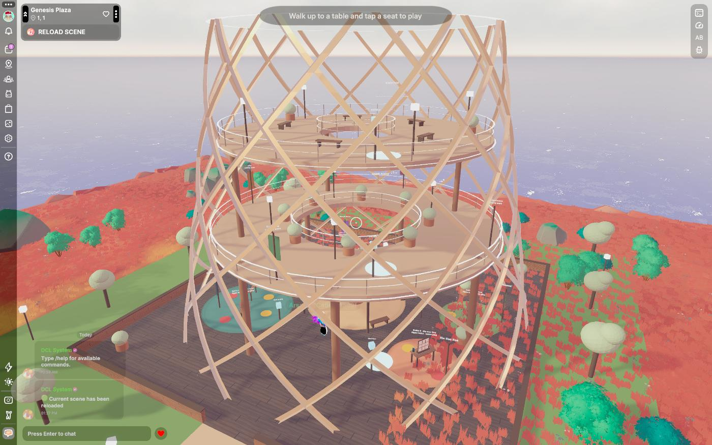
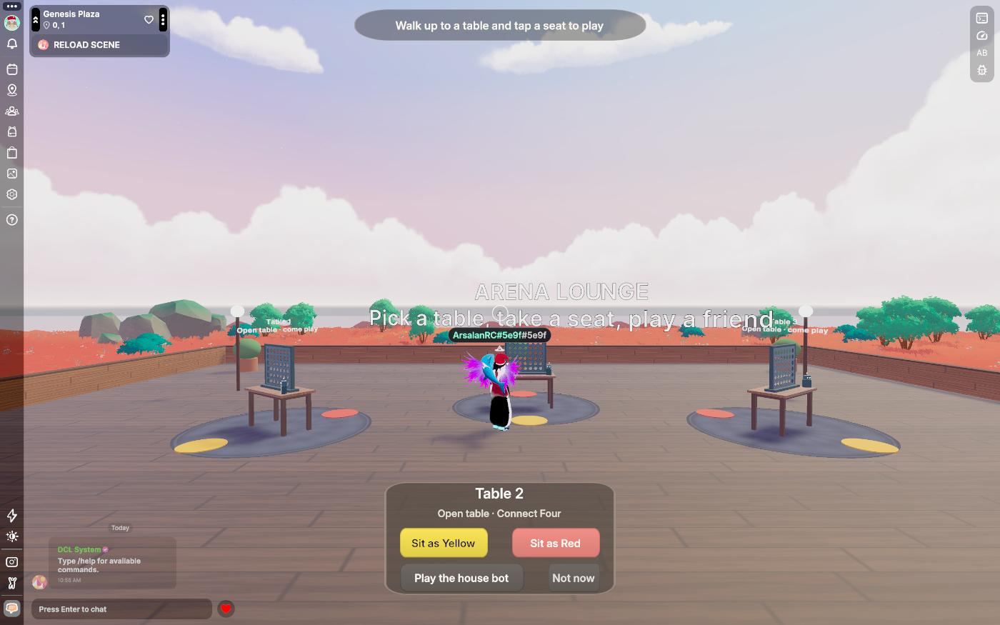
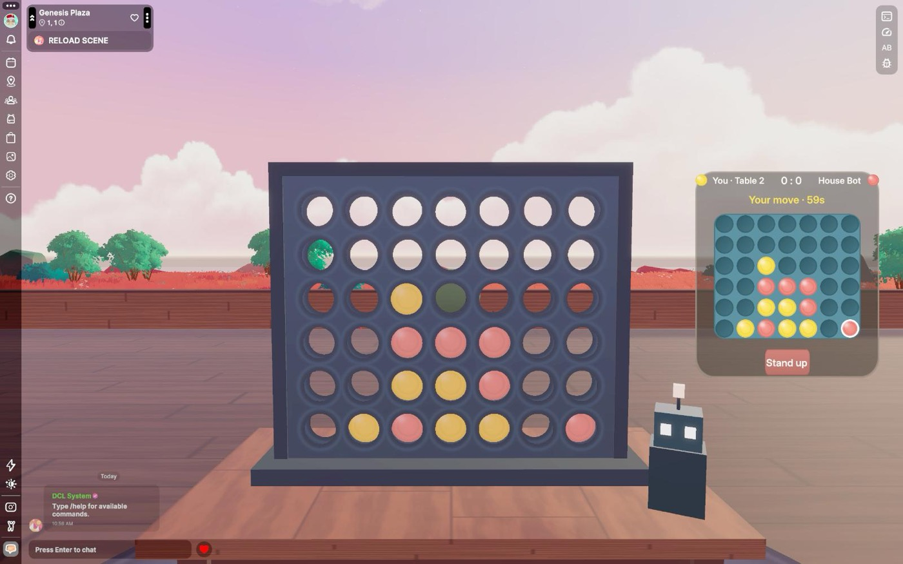
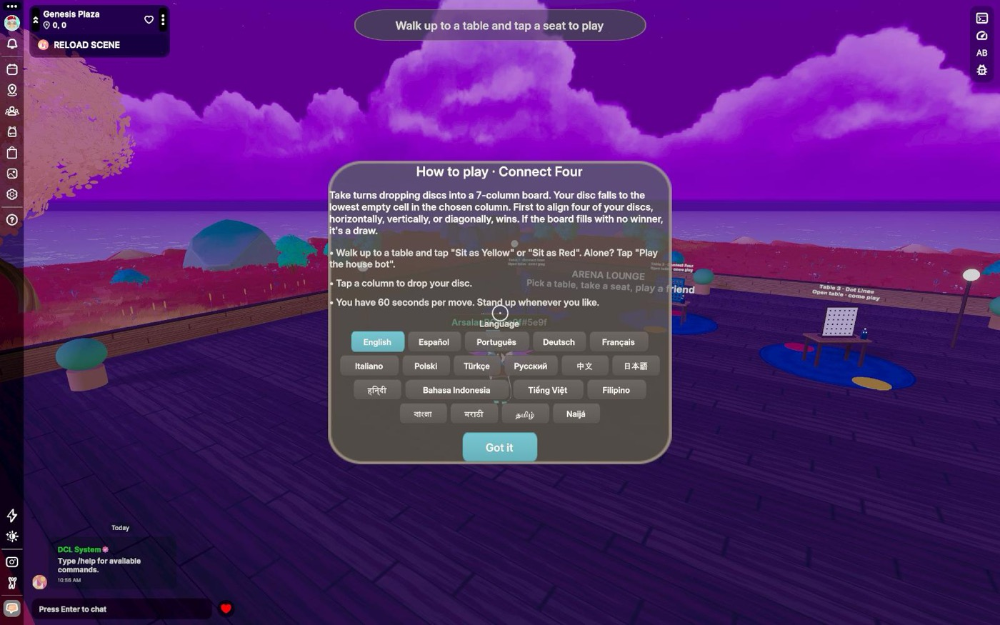

# Arena Lounge

A game lounge for Decentraland, built for phones first. Walk in under the
twisted tower, pick a corner, take a seat, and play Four in a Row, Dot Lines,
Reversi, Tic Tac Toe, Match Pairs, Checkers, Chess, Croc Snap, Backgammon,
Ludo, Super Tic Tac Toe or Snakes & Ladders against a friend or the house
bot. Every table is shared: whoever is in the World sees
the same moves. Elevator pads take you up to the game room and the rooftop
terrace.

Built for the [Decentraland Friendzone Mobile Buildathon 2026](https://dorahacks.io/hackathon/2353/detail).

<table>
  <tr>
    <td width="50%"></td>
    <td width="50%"></td>
  </tr>
  <tr>
    <td width="50%"></td>
    <td width="50%"></td>
  </tr>
</table>

- **World:** `arenalounge.dcl.eth` (deployed at the end of the build phase)
- **Page:** https://arsalanrc.github.io/arena-lounge/ (EN / DE)
- **Stack:** Decentraland SDK7 (TypeScript, React-ECS UI, CRDT sync), no server, no downloads beyond two small generated GLBs
- **License:** MIT

## Why it fits a phone

- **UI is the controller, the 3D table is the show.** On mobile, tapping a 3D
  object means aiming a crosshair; tapping screen UI is direct. Seated players
  get a bottom bar with finger-sized controls: seven drop buttons for Connect
  Four, a board with 56-unit cells for the board games, a ring of teeth for
  Croc Snap, a board of 24 points plus a Roll button for Backgammon. Spectators watch the real board.
- **One tap to play.** Walk near a table and a card offers *Sit as Yellow*,
  *Sit as Red* or *Play the house bot*. Sitting snaps you onto the seat pad,
  facing the board, in first person. *Stand up* is always one tap away.
- **One step to change floors.** Stand on an elevator pad and a panel offers
  Lounge / Game room / Rooftop; a tap teleports you there. No stairs.
- **Nothing to download.** Every model is an SDK primitive except the tower
  and the leaf balls, two GLBs generated by a Python script (0.7 MB in
  total); every texture is a small procedural PNG. Thirteen tables, ~440
  entities (piece pools exist only while a round runs), 45k triangles on a 3x3 World, loads in seconds on 4G.
- **Safe-area aware, no hover states, no tiny targets, no rounded-corner CSS
  (unsupported on mobile), no dynamic lights or particles.**

## Why it is social

- Tables are shared CRDT state (`syncEntity`): seats, board, series score and
  turn timer are identical for everyone in the World, late joiners included.
- Empty seat? The floating sign says who is waiting for a rival. Full table?
  Stand behind either player and watch.
- Alone? The house bot keeps the table warm until a human shows up
  (minimax for the strategy games, memory for Match Pairs, pure luck for Croc
  Snap). Bots never sit alone: they leave with their human.
- 60-second turn timer, auto-stand when you wander off, and seat heartbeats so
  a dropped connection never blocks a table.

## Play it locally

```bash
pnpm install
pnpm start            # desktop Explorer preview
pnpm start:mobile     # prints a QR; scan it with the Decentraland mobile app (same Wi-Fi)
pnpm start:pair       # one server for desktop + phone (they share the comms room)
pnpm test             # engine unit tests
pnpm build            # bundle + strict type-check
pnpm build:prod       # the minified bundle that `deploy` ships
```

Requires Node 20+, pnpm 9+, and the Decentraland desktop client for the
desktop preview. The project uses pnpm with a hoisted `node_modules` because
the SDK resolves `@dcl/ecs` relative to `@dcl/js-runtime`.

## Project layout

| Path | What lives there |
|------|------------------|
| `src/engine/` | Pure TypeScript game engines with unit tests, no SDK imports. Copied from [Game Arena](https://github.com/fgamesforfun-star/game-platform); the chess bot gained a time budget for phones. |
| `src/lounge/config.ts` | Scene layout (48 m scene, fenced lounge, floors, zones, elevator), tunables, palette |
| `src/lounge/state.ts` | Synced components `TableBoard`, `TableSeatA`, `TableSeatB` |
| `src/lounge/games/` | The `TableGame` contract (`types.ts`), the registry and one plugin per game (rules bridge + touch controls) |
| `src/lounge/views/` | One 3D view per game (boards, sliding piece pools) + shared primitive builders |
| `src/lounge/tables.ts` | Seat / turn / bot / janitor logic, elevator rides, all systems. The write discipline for CRDT lives here |
| `src/lounge/table3d.ts` | The generic 3D table: top, seat pads, robot token, sign, sounds; hosts the game view |
| `src/lounge/lounge3d.ts` | Garden ring, fenced lounge, plaza, corners, the tower, elevator pads, game room and rooftop |
| `src/lounge/ui.tsx` | React-ECS UI: hint, toast, table card, elevator panel, seated controller, how-to-play panel |
| `src/lounge/i18n/` | Rule overviews in 19 languages (from Game Arena) + lounge tips |
| `models/` | `tower.glb` and `canopy.glb`, generated by `tools/gen-models.py` |
| `tools/gen-textures.py` | Regenerates every PNG in `images/` procedurally (no PIL needed) |
| `tools/dev/` | Explorer MCP harness for headless testing |

## Networking model (serverless)

Each table is one entity with three last-write-wins components so writers
never clobber each other:

- `TableBoard` (game id + engine state as JSON + turn, status, score) is
  written by the player to move, by whoever seats the second player (deal),
  or by a seated player applying the turn timeout.
- `TableSeatA` / `TableSeatB` are written by the seat holder (claim,
  heartbeat, leave) or by any client when the holder went silent for 30 s.

The pure engine validates every move; a client only writes a board it derived
from `applyMove`. Bot moves are computed by the human sharing the table.

## Roadmap

- [x] Twelve games from the same engine family: Four in a Row, Dot Lines, Reversi, Tic Tac Toe, Match Pairs, Checkers, Chess, Croc Snap, Backgammon, Ludo, Super Tic Tac Toe, Snakes & Ladders
- [ ] Sea Strike and a Dice Royale duel (need new corners)
- [x] The tower: game room and rooftop terrace, elevator pads
- [x] Sound effects (drop, win chime, your-move ding)
- [x] How-to-play panel in 19 languages (rules from Game Arena)
- [x] Lounge UI (cards, controller, toasts, signs, hints) in EN / DE / ES / PT / FR, other languages fall back to English
- [ ] Persistent leaderboard and streaks on the rooftop (Multiplayer Server + Storage)

## Credits

Design and code by Arsalan Khadim ([GitHub](https://github.com/ArsalanRC), [LinkedIn](https://www.linkedin.com/in/muhammad-arsalan-khadim-b87550259/), [Portfolio](https://arsalanrc.github.io)).
All games are public-domain classics or original variants; no third-party assets are used.
