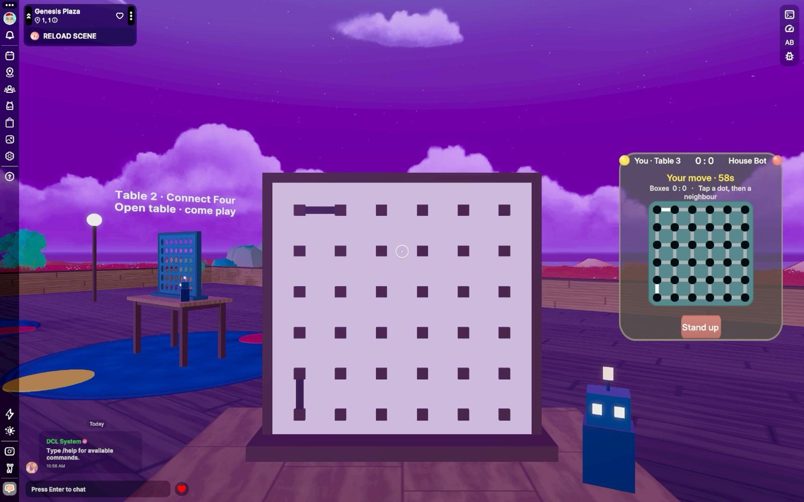

# Arena Lounge

A cosy game lounge for Decentraland, built for phones first. Walk in, pick a
corner, take a seat, and play Connect Four, Dot Lines, Reversi, Tic Tac Toe,
Match Pairs, Checkers, Chess or Croc Snap against a friend or the house bot. Every table
is shared: whoever is in the World sees the same moves. A twisted tower rises
over the plaza with a game room and a rooftop terrace, reached by elevator pads.

Built for the [Decentraland Friendzone Mobile Buildathon 2026](https://dorahacks.io/hackathon/2353/detail).

<table>
  <tr>
    <td width="50%"></td>
    <td width="50%"></td>
  </tr>
  <tr>
    <td width="50%"></td>
    <td width="50%"></td>
  </tr>
</table>

- **World:** `arenalounge.dcl.eth` (deployed at the end of the build phase)
- **Page:** https://arsalanrc.github.io/arena-lounge/ (EN / DE)
- **Stack:** Decentraland SDK7 (TypeScript, React-ECS UI, CRDT sync), no server, no downloads
- **License:** MIT

## Why it fits a phone

- **UI is the controller, the 3D table is the show.** On mobile, tapping a 3D
  object means aiming a crosshair; tapping screen UI is direct. Seated players
  get seven big drop buttons (or a mini board) at thumb height, spectators
  watch the real board.
- **One tap to play.** Walk near a table and a card offers *Sit as Yellow*,
  *Sit as Red* or *Play the house bot*. Sitting snaps you onto the seat pad,
  facing the board, in first person. *Stand up* is always one tap away.
- **Nothing to download.** Every model is an SDK primitive; every texture is a
  small procedural PNG. Three tables, ~500 entities, loads in seconds on 4G.
- **Safe-area aware, no hover states, no tiny targets, no rounded-corner CSS
  (unsupported on mobile), no dynamic lights or particles.**

## Why it is social

- Tables are shared CRDT state (`syncEntity`): seats, board, series score and
  turn timer are identical for everyone in the World, late joiners included.
- Empty seat? The floating sign says who is waiting for a rival. Full table?
  Stand behind either player and watch.
- Alone? The house bot (minimax, alpha-beta) keeps the table warm until a
  human shows up. Bots never sit alone: they leave with their human.
- 60-second turn timer, auto-stand when you wander off, and seat heartbeats so
  a dropped connection never blocks a table.

## Play it locally

```bash
pnpm install
pnpm start            # desktop Explorer preview
pnpm start:mobile     # prints a QR; scan it with the Decentraland mobile app (same Wi-Fi)
pnpm test             # engine unit tests
pnpm build            # bundle + strict type-check
```

Requires Node 20+, pnpm 9+, and the Decentraland desktop client for the
desktop preview. The project uses pnpm with a hoisted `node_modules` because
the SDK resolves `@dcl/ecs` relative to `@dcl/js-runtime`.

## Project layout

| Path | What lives there |
|------|------------------|
| `src/engine/` | Pure TypeScript game engines with unit tests. No SDK imports. `connectfour/` is the same engine that powers [Game Arena](https://github.com/fgamesforfun-star/game-platform). |
| `src/lounge/config.ts` | Table positions, tunables (turn limit, heartbeat, distances), palette |
| `src/lounge/state.ts` | Synced components `C4Board`, `C4SeatA`, `C4SeatB` and the bridge to the engine |
| `src/lounge/tables.ts` | Seat / turn / bot / janitor logic and all systems. The write discipline for CRDT lives here |
| `src/lounge/table3d.ts` | The 3D table: see-through frame, pooled discs with drop tweens, seat pads, robot token, sign |
| `src/lounge/lounge3d.ts` | Floor, walls, planters, lamps, welcome sign |
| `src/lounge/ui.tsx` | React-ECS UI: banner, table card, seated controller |
| `tools/gen-textures.py` | Regenerates every PNG in `images/` procedurally (no PIL needed) |

## Networking model (serverless)

Each table is one entity with three last-write-wins components so writers
never clobber each other:

- `C4Board` is written by the player to move, by whoever seats the second
  player (deal), or by a seated player applying the turn timeout.
- `C4SeatA` / `C4SeatB` are written by the seat holder (claim, heartbeat,
  leave) or by any client when the holder went silent for 30 s.

The pure engine validates every move; a client only writes a board it derived
from `applyMove`. Bot moves are computed by the human sharing the table.

## Roadmap

- [ ] Persistent leaderboard and streaks (Multiplayer Server + Storage)
- [x] Eight games from the same engine family: Connect Four, Dot Lines, Reversi, Tic Tac Toe, Match Pairs, Checkers, Chess, Croc Snap
- [ ] Backgammon and Ludo for the remaining game-room corners
- [x] Sound effects (drop, win chime, your-move ding)
- [x] How-to-play panel in 19 languages (rules from Game Arena), lounge tips EN/DE/ES
- [ ] Full lounge UI localisation

## Credits

Design and code by Arsalan Khadim ([GitHub](https://github.com/ArsalanRC), [LinkedIn](https://www.linkedin.com/in/muhammad-arsalan-khadim-b87550259/), [Portfolio](https://arsalanrc.github.io)).
Connect Four is a public-domain game; no third-party assets are used.
